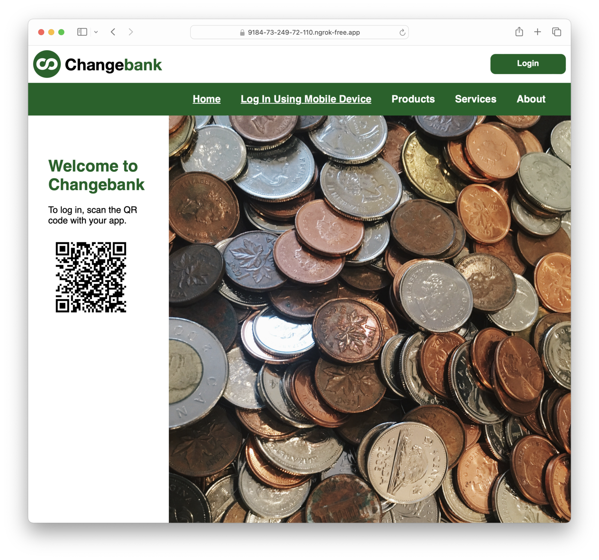

# Example Flask Application 

This repo holds an example Python/Flask application that uses FusionAuth as the identity provider. 
This application will use an OAuth Device Code Grant workflow to log a user in and get them access and 
refresh tokens across devices.

The scenario is if you have a logged in phone and a logged out computer. The phone scans a QR code generated by the computer on a public page, and then after the user submits the user code, the laptop is logged in.

This application was built on top of the [Python/Flask Quickstart](https://fusionauth.io/docs/quickstarts/quickstart-python-flask-web).

## Results

Here's an image of the QR code you can use to log in to the application from a logged in phone using the Device Code Grant.



## Project Contents

The `docker-compose.yml` file and the `kickstart` directory are used to start and configure a local FusionAuth server.

The `/complete-application` directory contains a fully working version of the application.

## Project Dependencies
* Docker, for running FusionAuth
* Python 3.8 or later, for running the Changebank Python application
* ngrok for multi-device access

## Running Ngrok

To run the application, first set up ngrok. ngrok is a free developer tool which lets you expose applications running on localhost to the internet. Learn more at [ngrok.com](https://ngrok.com/).

You'll need two different ngrok servers, one for the flask app and one for the FusionAuth server. This is because both need to be accessible from your mobile device.

These instructions are for users with a free ngrok account. To run with multiple servers on a free account, you need to update your `ngrok.yml` file. You can find out where your config file lives by reading the [ngrok doc](https://ngrok.com/docs/agent/config/).

Add these lines to your ngrok.yml file:

```
tunnels:
  fa:
    proto: http
    addr: 9011
  flask:
    proto: http
    addr: 5000
```

Now, start up the two servers by running:

```shell
ngrok start --all
```

You'll see some output, but the important section looks like this:

```
Forwarding                    https://9184-73-249-72-110.ngrok-free.app -> http://localhost:5000
Forwarding                    https://b27b-73-249-72-110.ngrok-free.app -> http://localhost:9011
```

You will need the forwarding URLs below.

## Running FusionAuth

Update the `variables` section of `kickstart/kickstart.json`. Modify the `app_url` and `issuer_url` values to point to your ngrok URLs. The `app_url` is what forwards to port 5000 (the flask app) and the `issuer_url` is what forwards to port 9011 (the FusionAuth app).

With the ngrok command output above, it would look like this:

```
    "issuer_url": "https://b27b-73-249-72-110.ngrok-free.app",
    "app_url": "https://9184-73-249-72-110.ngrok-free.app",
```

Then, to run FusionAuth, stand up the docker containers using `docker-compose`.

```shell
docker-compose up
```

This will start a PostgreSQL database, and Elastic service, and the FusionAuth server.

## Running the Example App

Set up a Python virtual env and installing the project dependencies.

```shell
python -m venv venv && \
source venv/bin/activate && \
pip install -r requirements.txt
```

Update the issuer value in `.env-flask` to match the value provided by ngrok. With the ngrok command output above, it would look like this:

```
ISSUER=https://b27b-73-249-72-110.ngrok-free.app
```

Then use the `python` command to start up the application.

```shell
python server.py
```

Using `flask` to start the application will not work because of threading.

Visit the local webserver at the ngrok URL from your phone and sign in using the credentials:

* username: richard@example.com
* password: password

Then, visit the local webserver at the ngrok URL from your laptop. Click on the 'Log In Using Mobile Device' link. 

Scan the QR code with your phone, and complete the device grant.

You should be logged in on the laptop.

## Extending This Example

If the user is logged in on their laptop and wants to log in with the phone, the phone would need to start the grant and display a URL, the laptop would need to go to that URL, and the phone would need to poll the token endpoint to see when the laptop had completed the grant.
